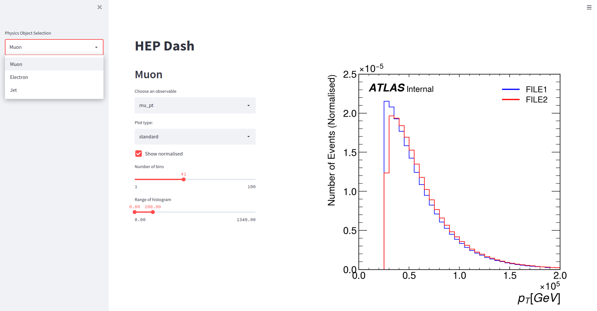

# HEP Dash

Designed to take ROOT TTrees and build interactive web-browser-based notebooks.

Possibly use streamlit, dash more advanced?

Think about functionality and optimal use case...

Most up-to-date functionality so far is the `make_premade_comparison_app.py` function. `make_general_comparison_app.py` has also been created.




For effective README exhibiting features of the app, use this site to create screen recordings: https://gifcap.dev/

## Features

Histograms can be manipulated and downloaded.


## Installation


### Github
Feel free to clone the directory. Preferred: install via `pip` through:
```bash
python3 -m pip install git+https://github.com/ethansimpson285/HEPDash.git
```

### Other
From PyPi - not uploaded.


## From Trees

Generate and deploy a HEP-Dash app using ROOT TTrees! HEP-Dash automatically handles the histogram construction, projection and rendering.

Pass any number of ROOT files with specified TTrees

There are several varieties of 
* General - App will diplay histograms for each branch common to all the ROOT TTrees given.
* Preset - App will display (pT,eta,phi,E) histograms for electron, muon and jet objects.
* Specific - App will display histograms specified by the user.

Requires a `config.yml` file to run, which contains the information on each ROOT sample.

To run:

```bash
python3 -m hepdash.funcs.make_tree_argparse --mode <option> --config config1.yml
```
where `option` corresponds to one of the three options above.

### Development Notes
* General - Built in 0.0.4, histogram image does not fit on screen.
* Preset  - Built in 0.0.3, works.
* Specific - under development

## From Histograms

Display and manipulate ROOT histograms (maybe other types?) through a HEP-Dash app!


## Additional Information on Code
The current implementation selects branches and projects into histograms each time the streamlit app flow is updated (i.e. every time a button is pressed). This was found to be faster than storing all branches and accessing them when necessary. However, for larger scale presentation of multiple histograms, this will possibly become necessary...


## Adding argparse
Doesn't work well with running from Python.
Can do 
```
streamlit run <path2file>.make_tree_argparse.py -- <args>
```
